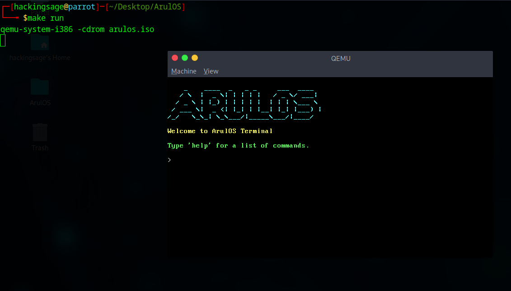
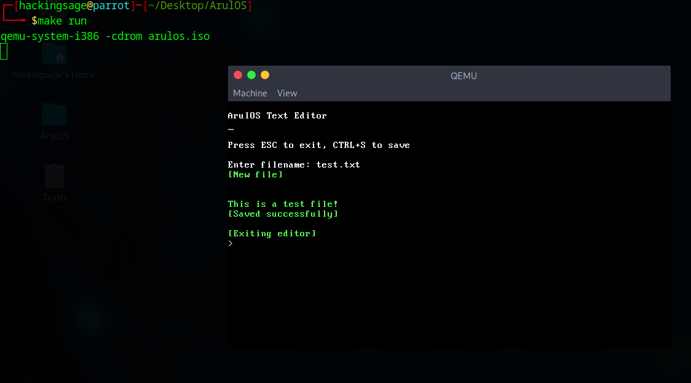
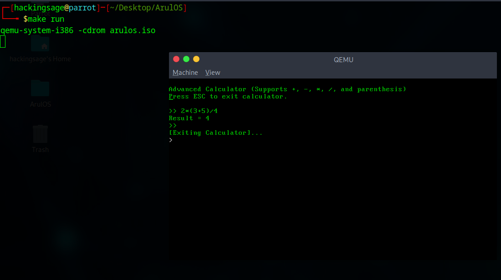

# ArulOS

**ArulOS** is a 32-bit x86 operating system built from scratch in C and Assembly. It includes a Multiboot-compliant kernel, a custom shell, an in-memory filesystem, a built-in editor and calculator, and various utilities like tab completion, command history, and clean shutdown support — all documented and bootable via GRUB.

---

## ✨ Features

- Multiboot-compliant GRUB bootloader
- VGA text output with scrolling and color
- PS/2 keyboard driver (arrow keys, shift, backspace)
- Command-line shell with:
  - `ls`, `touch`, `rm`, `cat`, `clear`
  - Command history navigation (↑ / ↓)
  - Tab completion for filenames
- `run editor`: simple terminal-based text editor (Ctrl+S to save, ESC to exit)
- `run calc`: built-in arithmetic calculator
- Shutdown support via `shutdown` / `exit` (QEMU ACPI)

---

## 📂 Project Structure

```
ArulOS/
├── src/                    # All source code
│   ├── kernel.c            # Entry point with shell loop
│   ├── shell/              # Command parser, input handling
│   ├── fs/                 # In-memory file system (ArulFS)
│   ├── applications/       # Editor and calculator code
│   ├── components/         # Keyboard, I/O port code & HEAP management
│   ├── screen/             # VGA text-mode output
│   ├── string/             # String functions
├── grub.cfg                # GRUB bootloader config
├── linker.ld               # Linker script
├── makefile                # Build system
├── iso/                    # Output ISO directory structure
└── images/                 # Screenshots (see below)
```

---

## 💻 Commands

| Command         | Description                        |
|----------------|------------------------------------|
| `ls`           | List files in the file system      |
| `touch <file>` | Create a new file                  |
| `cat <file>`   | View contents of a file            |
| `rm <file>`    | Delete a file                      |
| `run editor`   | Launch in-terminal editor          |
| `run calc`     | Launch calculator with expression support |
| `clear`        | Clear the screen                   |
| `shutdown` / `exit` | Power off system (QEMU ACPI)  |
| `reboot`       | Reboot the system                  |

---

## 🧮 Applications

### Text Editor
- Simple line-by-line terminal editor
- Press `Ctrl+S` to save, `ESC` to exit

### Calculator
- Supports `+`, `-`, `*`, `/`, parentheses
- Parses expressions like: `(3 + 5) * 2 - 1`

---

## 📷 Screenshots

### Boot & Shell


### Editor


### Calculator


---

## 🛠️ Build & Run

### Prerequisites

- `i686-elf-gcc` cross-compiler
- `grub-mkrescue`
- `qemu-system-i386`

### Commands

```bash
make         # Build the ISO
make run     # Run in QEMU
```

---

## 📜 License

MIT License — see [LICENSE](LICENSE)

---

## 👨‍💻 Author

Built by [@hackingsage](https://github.com/hackingsage)  
Created as a personal project to explore OS development, low-level systems, and independent engineering.